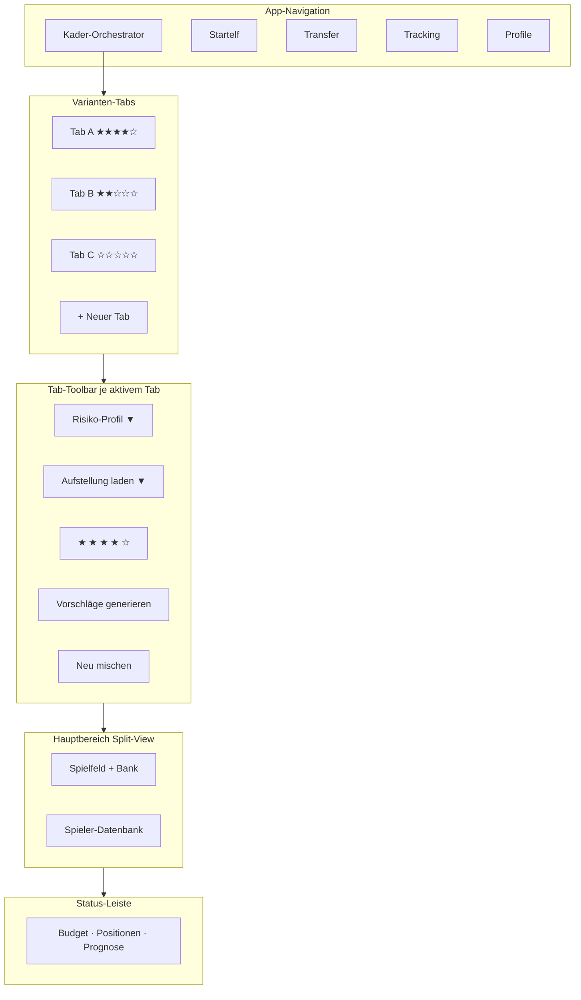

# Wireframe – Kader-Orchestrator

> **Status:** Wireframe v1 (Konzeptphase, kein Code)  
> **Ziel:** Vorlage für Google Stitch Mockup  
> **Bezug:** [Konzept UI](./konzept-draft-orchestrator-ui.md) · [Spielregeln](./spielregeln-kicker-ia.md)

---

## 1. Entscheidungen (fixiert)

| # | Entscheidung |
|---|--------------|
| 1 | **Tabs** für Kader-Varianten – pro Tab eigenes Risiko-Profil + eigenes Laden |
| 2 | Pro Tab **5-Sterne-Bewertung** → User wählt Favorit selbst |
| 3 | Split-View: **Spielfeld links** (11 + Bank 11), **Spieler-DB rechts** |
| 4 | **Auto-Save:** Jede Änderung speichert den aktiven Tab sofort – kein manueller Speichern-Button |
| 5 | Stitch-Handoff: [`stitch-handover.md`](./stitch-handover.md) |

---

## 2. Bildschirm-Übersicht



---

## 3. Wireframe – Gesamtansicht (Desktop 1920×1080)

```
╔══════════════════════════════════════════════════════════════════════════════════════════╗
║  KMI Orchestrator          [Kader-Orchestrator]  Startelf  Transfer  Tracking  Profile   ║
╠══════════════════════════════════════════════════════════════════════════════════════════╣
║                                                                                          ║
║  VARIANTEN-TABS                                                                          ║
║  ┌─────────────────┬─────────────────┬─────────────────┬──────────┐                       ║
║  │ ● Variante A    │   Variante B    │   Variante C    │  + Neu   │                       ║
║  │   ★ ★ ★ ★ ☆     │   ★ ★ ☆ ☆ ☆     │   ☆ ☆ ☆ ☆ ☆     │          │                       ║
║  └─────────────────┴─────────────────┴─────────────────┴──────────┘                       ║
║                                                                                          ║
║  TAB-TOOLBAR (nur aktiver Tab)                                                           ║
║  ┌──────────────────────────────────────────────────────────────────────────────────┐   ║
║  │ Risiko-Profil: [ Überperformer-Jäger        ▼]    Favorit: [★][★][★][★][☆]      │   ║
║  │ Aufstellung:   [ Laden…                    ▼]    [Vorschläge generieren] [Mischen]│   ║
║  │                 └─ Gespeicherte Kader                                            │   ║
║  │                 └─ Import aus Datei                                                │   ║
║  │                 └─ Leeren / Zurücksetzen                                           │   ║
║  └──────────────────────────────────────────────────────────────────────────────────┘   ║
║                                                                                          ║
║  ┌────────────────────────────────────────────┬─────────────────────────────────────┐   ║
║  │  SPIELFELD  (58 %)                         │  SPIELER-DATENBANK  (42 %)          │   ║
║  │                                            │                                     │   ║
║  │  Formation: [ 4-3-3 ▼ ]   Kennzahl: [xPkt▼]│  🔍 Suche…                          │   ║
║  │                                            │  Pos[Alle▼] Verein[Alle▼] [Filter+] │   ║
║  │  ┌──────────────────────────────────────┐  │  Sortieren: [xPunkte ▼] [↓] [Spalten]│   ║
║  │  │           🟩 GRÜNES SPIELFELD        │  │  ┌───────────────────────────────┐  │   ║
║  │  │                                      │  │  │ Foto │ Name    │Pos│MW │xPkt│  │   ║
║  │  │      [ST]    [ST]    [ST]            │  │  ├──────┼─────────┼───┼───┼────┤  │   ║
║  │  │                                      │  │  │ 📷   │ Kane    │STU│8.5│198 │  │   ║
║  │  │         [MIT] [MIT] [MIT]            │  │  │ 📷   │ Olise   │MIT│8.0│163 │  │   ║
║  │  │                                      │  │  │ 📷   │ Guirassy│STU│6.5│142 │  │   ║
║  │  │   [ABW] [ABW] [ABW] [ABW]            │  │  │ 📷   │ Coufal  │ABW│1.8│113 │  │   ║
║  │  │                                      │  │  │ …    │ …       │…  │…  │…   │  │   ║
║  │  │              [TW]                    │  │  └───────────────────────────────┘  │   ║
║  │  └──────────────────────────────────────┘  │  [ + In Kader ]  [ Ausschließen ]   │   ║
║  │                                            │  [ Details öffnen ]                 │   ║
║  │  ── ERSATZBANK (11 / 22) ────────────────  │                                     │   ║
║  │  STURM   [▢][▢]                           │  Schnellfilter:                     │   ║
║  │  MITTEL  [▢][▢][▢]                         │  [Überperformer] [Unter 2M]        │   ║
║  │  ABWEHR  [▢][▢][▢]                         │  [Comeback] [Neuzugang]             │   ║
║  │  TOR     [▢][▢]                            │                                     │   ║
║  └────────────────────────────────────────────┴─────────────────────────────────────┘   ║
║                                                                                          ║
║  STATUS-LEISTE                                                                           ║
║  ┌──────────────────────────────────────────────────────────────────────────────────┐   ║
║  │ Budget ████████████░░░  38,2 / 42,5 Mio.€ │ 22/22 │ TOR 3/3 ABW 7/7 MIT 7/7 STU 5/5│   ║
║  │ xPunkte: 1.412 │ Pkt/Mio: 37 │ ✅ Regelkonform │ Auto-Save ✓ │ [Export] [Vergleich] │   ║
║  └──────────────────────────────────────────────────────────────────────────────────┘   ║
╚══════════════════════════════════════════════════════════════════════════════════════════╝
```

---

## 4. Wireframe – Varianten-Tabs (Detail)

Jeder Tab = **eigenständiger Kader-Entwurf** mit eigenem Zustand.

```
┌──────────────────┬──────────────────┬──────────────────┬────────────┐
│ ● Variante A     │   Variante B     │   Variante C     │  + Neuer   │
│   ★ ★ ★ ★ ☆      │   ★ ★ ☆ ☆ ☆      │   ☆ ☆ ☆ ☆ ☆      │    Tab     │
│   Profil: Ü-Jäger│   Profil: Floor  │   (leer)         │            │
│   22/22 ✓        │   18/22 ⚠        │   0/22           │            │
└──────────────────┴──────────────────┴──────────────────┴────────────┘
       ▲ aktiv
```

### 4.1 Tab-Inhalt (Daten pro Tab)

| Feld | Beschreibung |
|------|--------------|
| `tab_id` | Interne ID |
| `label` | „Variante A“ (umbenennbar per Doppelklick) |
| `risk_profile_id` | **Eigenes Profil pro Tab** |
| `star_rating` | 0–5 (User-Favorit) |
| `squad[22]` | Spieler-Slots |
| `formation` | z. B. 4-3-3 |
| `locked_players[]` | Für Re-Mix |
| `excluded_players[]` | Blacklist |
| `loaded_from` | Optional: Quelle beim Laden |

### 4.2 Tab-Aktionen

| Aktion | Verhalten |
|--------|-----------|
| **Tab wechseln** | Zustand bleibt erhalten, nichts geht verloren |
| **+ Neuer Tab** | Leerer Kader, Default-Profil = zuletzt genutztes |
| **Tab schließen** | Confirm wenn nicht leer |
| **Tab umbenennen** | Doppelklick auf Label |
| **Sterne klicken** | 1–5 Sterne setzen; nur visueller Favorit, kein Auto-Sort |

### 4.3 Sterne-Logik

```
Favorit:  [ ★ ] [ ★ ] [ ★ ] [ ★ ] [ ☆ ]   ← klickbar, pro Tab unabhängig

Vergleichsansicht (optional, Button „Vergleich“):
┌────────────┬────────┬────────┬────────┬────────┐
│            │ Tab A  │ Tab B  │ Tab C  │        │
├────────────┼────────┼────────┼────────┼────────┤
│ Sterne     │ ★★★★☆  │ ★★☆☆☆  │ ☆☆☆☆☆  │        │
│ Profil     │ Ü-Jäger│ Floor  │ —      │        │
│ xPunkte    │ 1.412  │ 1.298  │ —      │        │
│ Pkt/Mio    │ 37     │ 41     │ —      │        │
│ Budget     │ 38,2M  │ 39,1M  │ —      │        │
│ Status     │ ✅     │ ⚠ 18/22│ leer   │        │
└────────────┴────────┴────────┴────────┴────────┘
```

**Regel:** Sterne sind **subjektiv** (User-Präferenz), nicht automatisch vom Solver. So kann Tab B weniger xPunkte haben, aber 5 Sterne – wenn er sich „besser anfühlt“.

---

## 5. Wireframe – Tab-Toolbar

```
┌─────────────────────────────────────────────────────────────────────────────┐
│                                                                             │
│  Risiko-Profil                    Aufstellung laden                           │
│  ┌─────────────────────────┐    ┌─────────────────────────┐                  │
│  │ Überperformer-Jäger   ▼│    │ Laden…                ▼│                  │
│  └─────────────────────────┘    └─────────────────────────┘                  │
│   ├ Sicherheits-FC              ├ 📁 BL-Entwurf 12.07. (22/22)              │
│   ├ Ausgewogen                  ├ 📁 Floor-Variante (18/22)                   │
│   ├ Überperformer-Jäger ✓       ├ 📁 Import CSV-Kader                       │
│   ├ Ceiling-Hunter              └ ↺ Leeren                                   │
│   └ + Profil bearbeiten…                                                    │
│                                                                             │
│  Favorit (dieser Tab)     Engine                                            │
│  [★][★][★][★][☆]          [ Vorschläge generieren ]  [ Neu mischen ]        │
│                                                                             │
└─────────────────────────────────────────────────────────────────────────────┘
```

### 5.1 „Aufstellung laden“ Dropdown

| Eintrag | Aktion |
|---------|--------|
| Gespeicherte Kader… | Liste aller `SavedSquad` → überschreibt **nur aktiven Tab** |
| Aus anderem Tab kopieren… | Tab A → Tab B duplizieren |
| Import JSON/CSV | Externer Stand |
| Leeren | 22 Slots zurücksetzen (Confirm) |

**Wichtig:** Laden betrifft **nur den aktiven Tab**. Profil kann beim Laden mitkommen oder User wählt danach neu.

---

## 6. Wireframe – Spielfeld (Spielerkarte)

```
┌─────────────────┐
│  ┌───────────┐  │
│  │   FOTO    │  │  ← SofaScore player image
│  │  [Club🔵] │  │  ← Vereinslogo overlay
│  └───────────┘  │
│  ┌───────────┐  │
│  │   Kane    │  │  ← Name
│  │  26 Pkt   │  │  ← gewählte Kennzahl (Dropdown global)
│  │  🔒       │  │  ← Lock (optional)
│  └───────────┘  │
└─────────────────┘
     │
     ├─ Cyan-Rand  = Orchestrator-Vorschlag (unverändert)
     ├─ Amber-Rand = manuell getauscht
     └─ Rot-Rand   = Validierungsfehler (falsche Pos.)
```

### 6.1 Leerer Slot

```
┌─────────────────┐
│  ┌───────────┐  │
│  │    +      │  │  ← Klick öffnet DB gefiltert auf Position
│  │  ABW frei │  │
│  └───────────┘  │
└─────────────────┘
```

### 6.2 Bank-Gruppen (unter dem Feld)

```
── ERSATZBANK ──────────────────────────────────────────
STURM     [Kane★] [Diaz ] [  +  ] [  +  ] [  +  ]     ← 5 Slots, 2 belegt
MITTEL    [Olise] [Kimmich] [ ... 7 Slots total in squad ]
ABWEHR    [ ... 7 Slots ]
TOR       [Neuer] [Urbig] [  +  ]
```

---

## 7. Wireframe – Spieler-Datenbank

### 7.1 Tabellenkopf (sortierbar)

```
┌────┬──────────┬─────┬──────┬──────┬───────┬───────┬────────┬──────┐
│ ☐  │ Spieler  │ Pos │ MW   │ xPkt │ P/Mio │ STAB  │ Ü-Score│ Form │
├────┼──────────┼─────┼──────┼──────┼───────┼───────┼────────┼──────┤
│ ☐  │ 📷 Kane  │ STU │ 8,5M │ 198  │ 23    │ 4,2   │ 12     │ ▲▲▲  │
│ ☐  │ 📷 Olise │ MIT │ 8,0M │ 163  │ 20    │ 3,8   │ 8      │ ▲▲   │
└────┴──────────┴─────┴──────┴──────┴───────┴───────┴────────┴──────┘
     ▲ Klick auf Spaltenkopf = Sort ASC/DESC
```

### 7.2 Spalten-Picker (Overlay)

```
Angezeigte Spalten:
☑ Marktwert        ☑ xPunkte         ☑ Pkt/Mio
☑ STAB-Index       ☑ Überperformer   ☐ SofaScore Rating
☑ Floor/Ceiling    ☐ GEILHEIT        ☐ LLM-Confidence
                              [ Übernehmen ]
```

### 7.3 Spieler-Detail (Drawer, rechts über DB)

```
┌─────────────────────────────────────┐
│  ✕                                  │
│  Harry Kane · STU · Bayern          │
│  ┌─────────────────────────────────┐│
│  │     [Foto groß]                 ││
│  └─────────────────────────────────┘│
│  MW: 8,5M │ xPkt: 198 │ P/Mio: 23  │
│  ── Spieltags-Prognose SP01-34 ──   │
│  ▁▂▃▅▆▇█▆▅▄▃▂▁▂▃▄▅▆▇█▆▅▄▃▂▁▂▃▄▅▆   │
│  ── LLM-Begründung ──               │
│  „Stammspieler, wenig Rotation…"   │
│  [ + In Kader ] [ Ausschließen ]    │
└─────────────────────────────────────┘
```

---

## 8. Wireframe – Zustände

### 8.1 Leerer Tab (Initial)

```
Tab C: ☆☆☆☆☆
Profil: [ Ausgewogen ▼ ]
Spielfeld: 22 leere Slots (+)
DB: volle Spielerliste
CTA hervorgehoben: [ Vorschläge generieren ]
```

### 8.2 Nach „Vorschläge generieren“

```
22 Slots gefüllt, Cyan-Ränder
Status: ✅ Regelkonform (wenn Constraints OK)
Toast: „22 Spieler vorgeschlagen · 1.412 xPunkte erwartet · gespeichert"
```

### 8.3 Ungültiger Kader

```
Status-Leiste: ⚠ 18/22 · ABW 5/7
Auto-Save: läuft weiter (Entwurf bleibt erhalten)
Export: disabled mit Tooltip „Kader unvollständig"
```

### 8.4 Laden in belegten Tab

```
Confirm-Dialog:
„Aufstellung ‚BL-Entwurf 12.07.‘ in Tab B laden?
 Aktueller Inhalt (18 Spieler) wird ersetzt."
 [ Abbrechen ]  [ Ersetzen ]  [ In neuen Tab laden ]
```

---

## 9. Interaktions-Matrix

| User-Aktion | Reaktion |
|-------------|----------|
| Tab klicken | Wechsel, Toolbar zeigt Tab-spezifisches Profil + Sterne |
| Profil ändern | Kein Auto-Rebuild; Hinweis „Profil geändert – neu generieren?" |
| Vorschläge generieren | Solver füllt leere Slots; respektiert Locks/Excludes |
| Neu mischen | Alternative Lösung, Locks bleiben |
| Spieler aus DB → Feld/Bank | Drag or [+ In Kader] |
| Sterne setzen | Nur lokaler Favorit-Marker |
| Auto-Save | Jede Änderung → sofort persistiert (Tab-Zustand, Profil, Sterne, Kader) |
| Laden | Dropdown → aktiver Tab (überschreibt mit Confirm) |
| Vergleich | Side-by-Side aller Tabs |

---

## 10. Auto-Save

| Trigger | Gespeichert |
|---------|-------------|
| Spieler hinzufügen/entfernen/tauschen | Kader-Slots |
| Profil wechseln | `risk_profile_id` |
| Sterne setzen | `star_rating` |
| Formation ändern | `formation` |
| Lock / Exclude | Listen |
| Tab umbenennen | `label` |
| Engine-Vorschlag übernehmen | Gesamter Tab |

- **Kein Speichern-Button** – stattdessen dezenter Indikator: `Gespeichert` / `Speichert…`
- Debounce ~300 ms bei schnellen Drag-Ops
- Stitch-Handover: [`stitch-handover.md`](./stitch-handover.md)

---

## 11. Responsive Hinweis

| Breakpoint | Verhalten |
|------------|-----------|
| ≥ 1920px | Volles Layout wie oben |
| 1280–1919px | DB schmaler, weniger Spalten default |
| < 1280px | Hinweis „Desktop empfohlen“; Tabs + Liste, kein Feld |

---

## 12. Nächste Schritte

1. ✅ Wireframe v1 (dieses Dokument)
2. ⏳ User-Review Tabs + Sterne
3. ⏳ Google Stitch Mockup
4. ⏳ Freigabe → Implementierung
